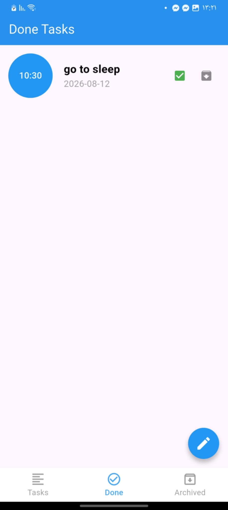
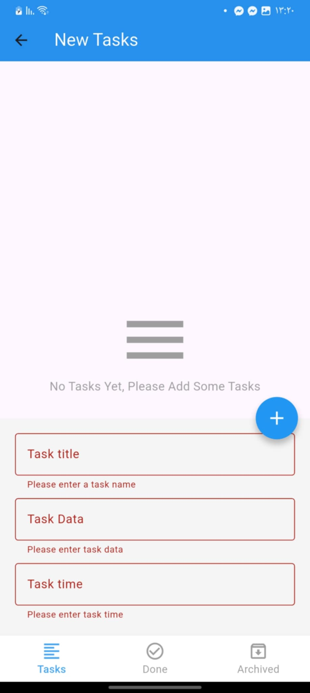
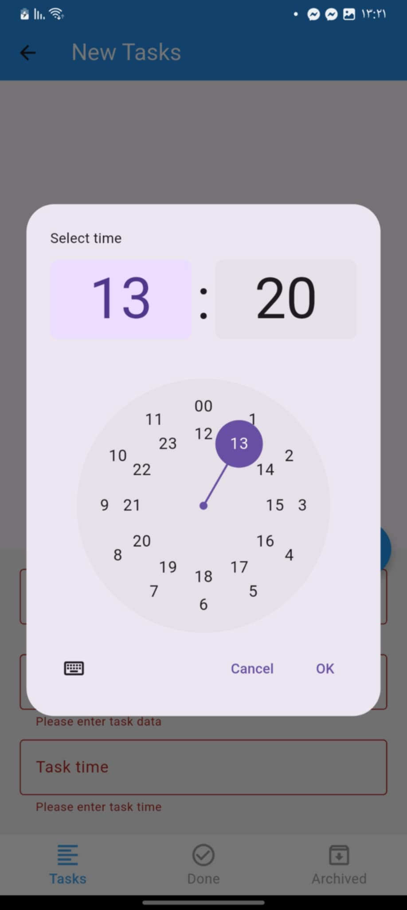
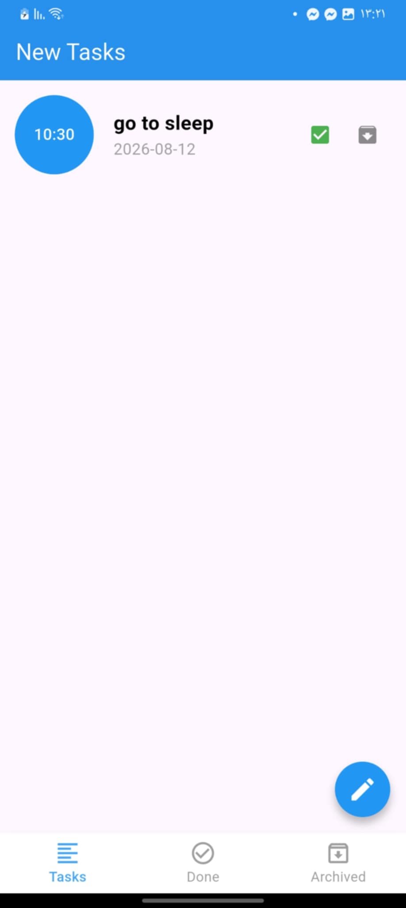
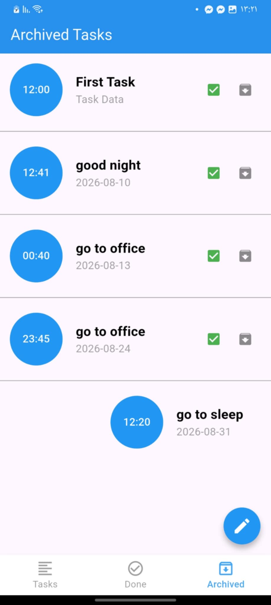
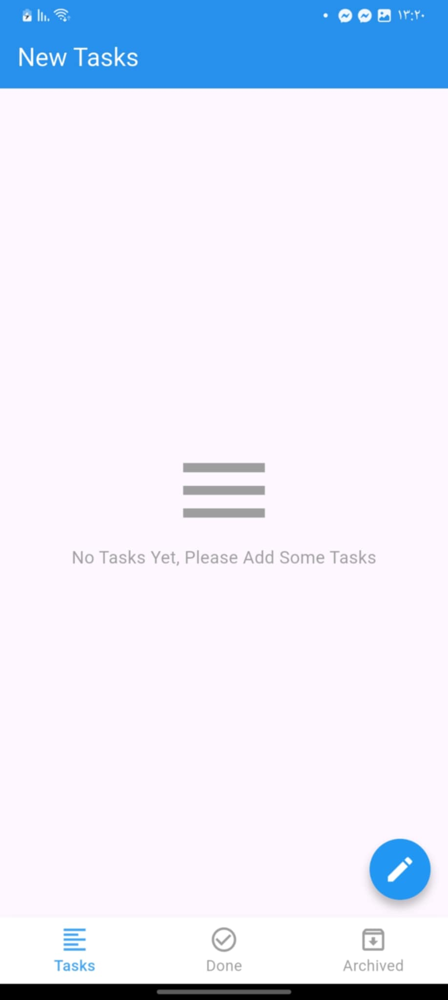

# Tasks App — Clean Architecture

A Flutter Tasks application built with **Clean Architecture** and **BLoC**, designed to demonstrate scalable Flutter development, local data persistence.

## Features

* Task management UI
* BLoC / Cubit state management
* SQLite local database using `sqflite`
* Reusable Flutter widgets
* Responsive and clean UI

## Technologies

| Technology         | Usage                   |
| ------------------ | ----------------------- |
| Flutter            | Application framework   |
| Dart               | Programming language    |
| BLoC               | State management        |
| Sqflite            | Local SQLite database   |

## 📸 Screenshots

> Add screenshots here after running the project.


|------|---------|----------|
|  |  |  |
|  |  |  |

---
## Architecture


```text
lib/
│
├── presentation/
│   ├── cubit/
│   ├── pages/
│   └── widgets/
│
└── main.dart
```

### Presentation Layer

Responsible for the UI and state management.

```text
presentation/
├── cubit/
├── pages/
└── widgets/
```

### Domain Layer

Contains the application's business logic and is independent from Flutter-specific implementations.

```text
domain/
├── entities/
├── repositories/
└── usecases/
```

## Local Database

The application uses **SQLite** through `sqflite` for storing tasks locally.

Example task data:

```text
Task
├── id
├── title
├── description
├── date
├── time
└── status
```

The repository pattern is used to keep database implementation separate from the application business logic.


## State Management

The project uses **BLoC/Cubit** to manage application state.

Typical states include:

```text
Initial
Loading
Success
Error
Empty
```

This keeps business logic outside the UI and makes the application easier to maintain and test.


## Getting Started

### 1. Clone the repository

```bash
git clone https://github.com/YOUR_USERNAME/tasks_app_clean_architecture.git
```

### 2. Navigate to the project

```bash
cd tasks_app_clean_architecture
```

### 3. Install dependencies

```bash
flutter pub get
```

### 4. Run the application

```bash
flutter run
```


## Packages

The project may use packages such as:

```yaml
dependencies:
  flutter:
    sdk: flutter

  flutter_bloc:
  equatable:
  sqflite:
  
```

Run:

```bash
flutter pub get
```

after adding or modifying dependencies.

## Project Goals

This project was created to demonstrate practical Flutter development using:

* Clean Architecture
* BLoC
* Repository Pattern
* Local database management
* Error handling
* Scalable project structure


## Author

**Mina Kamil**

Flutter Developer

* Flutter
* Dart
* BLoC
* Clean Architecture
* Firebase
* REST APIs

## License

This project is created for educational and portfolio purposes.
